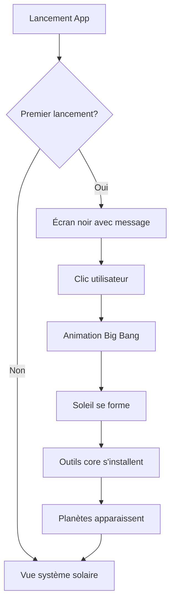
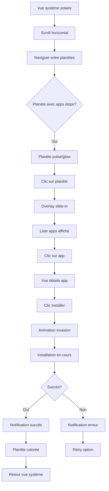
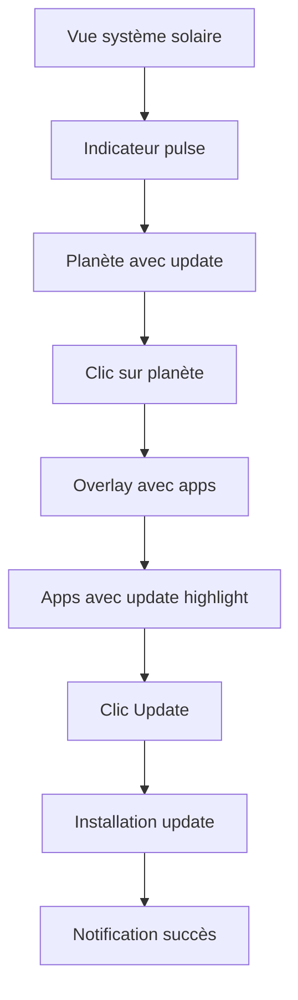
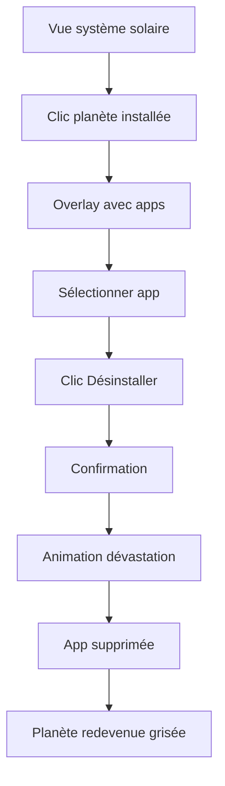

# UX Design Specification Sunshine-AIO

**Author:** Kilian
**Date:** 2026-02-21

---

## Executive Summary

### Project Vision

Sunshine-AIO est une application Windows de bureau offrant une interface 3D unique en forme de système solaire pour découvrir et installer des outils de game streaming. L'application remplace le menu console actuel par une navigation planétaire immersive où les planètes représentent les catégories d'applications communautaires.

### Target Users

- **Utilisateurs principaux:** Gamers souhaitant configurer le game streaming (Sunshine/Apollo, VDD, Playnite)
- **Profil technique:** Utilisateurs intermédiaires à avancés
- **Objectif:** Simplifier la découverte et l'installation d'applications communautaires pour le streaming

### Key Design Challenges

- **Navigation 3D intuitive:** Créer une interface où la navigation dans un système solaire 3D soit naturelle et intuitive
- **Performance 3D:** Maintenir 30 FPS minimum sur du matériel moyen
- **Onboarding immersif:** Animation "Big Bang" engageante au premier lancement
- **Transitions fluides:** Passer de la vue système solaire à la vue détaillée d'une planète/appli

### Design Opportunities

- **Métaphore géographique forte:** Système solaire = catalogue d'applications, Planètes = catégories
- **Feedback visuel unique:** Animations d'invasion/dévastation au lieu de barres de progression classiques
- **Indicateurs visuels:** Planètes pulsantes pour indiquer les mises à jour disponibles
- **Expérience narrative:** Histoire visuelle du "Big Bang" à la première utilisation

## Core User Experience

### Defining Experience

**Action principale:** Naviguer dans le système solaire 3D et installer des applications communautaires en quelques clics.

L'utilisateur ouvre l'application, voit son système solaire personnel avec les outils de streaming installés (planètes colorées) et les applications communautaires disponibles (planètes grisées). Il navigue horizontalement entre les planètes, clique sur une planète pour voir les applications disponibles, et peut installer une application en un clic.

### Platform Strategy

- **Plateforme:** Application de bureau Windows 10/11 uniquement
- **Entrée:** Souris (scroll horizontal, clics) et clavier (raccourcis optionnels)
- **Mode:** Fonctionnement hors ligne avec catalogue mis en cache
- **Contraintes:** Nécessite privilèges admin pour installations système

### Effortless Interactions

- **Scroll horizontal:** Navigation fluide entre les planètes avec inertie
- **Clic planète → Overlay:** Transition fluide vers les détails sans changement de page
- **Installation 1-clic:** Une action pour installer, feedback visuel immédiat
- **Retour vue système:** Bouton retour clair ou clic hors de l'overlay

### Critical Success Moments

- **Premier lancement:** Animation "Big Bang" réussie = utilisateur émerveillé
- **Première installation:** Invasion de la planète réussie = sentiment de progression
- **Découverte:** Trouver une nouvelle app communautaire = découverte agréable
- **Mise à jour:** Notification de mise à jour non intrusive

### Experience Principles

1. **Navigation = Exploration:** Le scroll dans le système solaire évoque la découverte spatiale
2. **Visual > Textuel:** Les animations et indicateurs visuels primcent sur les descriptions textuelles
3. **Feedback immédiat:** Chaque action utilisateur reçoit un feedback visuel instantané
4. **Onboarding narratif:** L'installation devient une histoire à vivre, pas une tâche à compléter

## Desired Emotional Response

### Primary Emotional Goals

**Émerveillement et Exploration**
L'utilisateur se sent comme un explorateur spatial découvrant de nouvelles planètes. L'interface 3D unique crée un sentiment de découverte et de magie.

**Sentiment de Progression**
Chaque installation d'application est une "conquête" de planète. L'utilisateur ressent un accomplissement tangible.

**Conquête et Puissance**
L'utilisateur maîtrise son environnement de streaming. Il a le contrôle total sur ses installations.

### Emotional Journey Mapping

- **Découverte (premier lancement):** Émerveillement → Curiosité → Anticipation
- **Navigation:** Fascination → Engagement → Exploration
- **Installation:** Anticipation → Excitation → Accomplissement
- **Succès:** Fierté → Satisfaction → Confiance
- **Retour:** Familiarité → Confort → Appartenance

### Micro-Emotions

| État souhaité | Éviter |
|--------------|--------|
| Confiance | Confusion |
| Excitation | Anxiété |
| Accomplissement | Frustration |
| Délice | Satisfaction moyenne |
| Appartenance | Isolation |

### Design Implications

- **Émerveillement →** Animations "Big Bang" fluides et spectaculaires, transitions 3D élégantes
- **Progression →** Animations d'invasion visuellement satisfaisantes, indicateurs de complétion
- **Confiance →** Feedback visuel clair, erreurs traitées avec grâce, pas de surprises négatives
- **Délice →** Petites animations de "delight" (particules, effets lumineux)

### Emotional Design Principles

1. **Chaque action = feedback visible:** L'utilisateur ne doute jamais de ce qui se passe
2. **L'erreur n'existe pas:** Les échecs sont des opportunités, pas des punitions
3. **La patience est récompensnée:** Les attentes sont animées, pas des sabliers
4. **Le personnelle devient intime:** Le système solaire reflète l'identité de l'utilisateur

## UX Pattern Analysis & Inspiration

### Inspiring Products Analysis

**Outer Wilds - Interface de navigation spatiale**

L'utilisateur a cité l'interface de navigation par carte des planètes du jeu Outer Wilds comme inspiration principale.

**Ce qui fonctionne bien:**
- **Vue d'ensemble miniature:** L'utilisateur voit todo le système solaire en un coup d'œil
- **Orbital paths visibles:** Les trajectoires orbitales montrent le mouvement des planètes
- **Clic direct sur planète:** Navigation immédiate vers la destination
- **Vue rotatable 3D:** Contrôle complet de la caméra
- **Zoom in/out:** Explorer les détails ou voir l'ensemble
- **Transitions fluides:** Passage seamless de la carte au jeu

### Transferable UX Patterns

| Pattern Outer Wilds | Adaptation Sunshine-AIO |
|---------------------|------------------------|
| Miniature solar system | Vue d'ensemble du système solaire personnel |
| Orbital paths | Trajectoires orbitales des catégories |
| Clic direct = voyage | Clic planète = overlay détails |
| Rotation自由的 | Rotation caméra avec souris |
| Zoom niveaux | Zoom entre vue système et planète |
| Clic planète → teleport | Clic planète → vue détaillée avec apps |

### Anti-Patterns to Avoid

- **Interface surchargée:** Trop d'options visibles en même temps
- **Navigation multi-niveaux:** Plusieurs clics pour atteindre une destination
- **Feedback absent:** Pas de confirmation visuelle des actions
- **Transitions brutales:** Changements d视图 sans animation

### Design Inspiration Strategy

**Adopter:**
- Vue d'ensemble miniature du système solaire
- Clic direct sur planète pour les détails
- Transitions fluides entre vue système et détails

**Adapter:**
- Rotation caméra pour scroll horizontal (navigation latérale)
- Zoom progressif au lieu de téléportation instantanée

**Éviter:**
- Menus contextuels complexes
- Icônes unclear sans labels

## Design System Foundation

### Design System Choice

**Custom Design System (3D + UI)**

Approche选择了自定义设计系统，专门为Sunshine-AIO的独特需求定制。

### Rationale for Selection

- **Visuel unique type Outer Wilds:** L'interface 3D nécessite un contrôle total sur l'apparence
- **Expérience immersive:** Les design systems classiques ne couvrent pas le 3D
- **Identité de marque:** Interface spatiale unique pour se différencier des installateurs classiques
- **Performance:** Contrôle direct sur le rendu Three.js

### Implementation Approach

**Architecture technique:**
- **3D Layer:** Three.js ou React-Three-Fiber pour le système solaire
- **UI Layer:** Composants UI personnalisés pour overlays et modales
- **Communication:** IPC entre frontend (Electron) et backend (Python)

**Tokens de design à définir:**
- Palette de couleurs spatiales (fond noir, planètes colorées,soleil lumineux)
- Typographie pour overlays UI
- Animations standardisées (transitions, hover states)
- Effets visuels (particules, glow, ombres)

### Customization Strategy

1. **Composants 3D personnalisés:**
   - Planètes procédurales avec textures uniques
   - Soleil avec effets lumineux
   - Particules d'ambiance spatiale
   - Orbites et trajectoires

2. **Composants UI personnalisés:**
   - Cards d'applications
   - Boutons d'installation
   - Notifications et toasts
   - Overlays de détails

3. **Système d'animations:**
   - Transitions vue système ↔ vue planète
   - Animations d'invasion/dévastation
   - Animations de feedback (succès, erreur)
   - Effets de hover et clic

## 2. Core User Experience

### 2.1 Defining Experience

**"Naviguer dans mon système solaire et installer des apps d'un clic"**

L'expérience définissante de Sunshine-AIO est la **navigation planétaire avec installation 1-clic**. L'utilisateur explore son système solaire personnel, découvre les planètes représentant les catégories d'applications, et installe les apps en un seul clic.

**Pitch utilisateurs:**
> "C'est comme un jeu où tu explores des planètes pour découvrir et installer des apps de streaming."

### 2.2 User Mental Model

**Attentes des utilisateurs:**
- Interface 3D immersive style jeu vidéo
- Navigation intuitive entre les catégories
- Installation simple et rapide
- Feedback visuel satisfaisant

**Modèle mental actuel:**
- Installateurs classiques = listes et boutons
- Sunshine-AIO = exploration spatiale et découverte

**Zones de confusion potentielles:**
- Comprendre que les planètes = catégories
- Navigation dans l'espace 3D
- Retour à la vue d'ensemble

### 2.3 Success Criteria

**Critères de succès:**

- **Navigation:** Le scroll horizontal entre planètes est fluide et intuitif
- **Clic:** Le clic sur planète ouvre les détails en < 300ms
- **Installation:** L'installation 1-clic fonctionne du premier coup
- **Feedback:** Chaque action reçoit un feedback visuel immédiat
- **Performance:** L'interface maintient 30 FPS minimum

### 2.4 Novel UX Patterns

**Pattern inovant:**
- Interface 3D narrative pour un installateur
- Animations d'invasion au lieu de barres de progression
- Planètes pulsantes comme indicateurs

**Pattern établi à adopter:**
- Clic = action (pattern familier)
- Overlay pour détails (pattern mobile/desktop)
- Bouton d'installation proéminent (pattern e-commerce)

### 2.5 Experience Mechanics

**Mécaniques d'expérience:**

1. **Initiation:**
   - Lancement app → Vue système solaire
   - Premier lancement → Animation Big Bang

2. **Interaction:**
   - Scroll horizontal pour naviguer entre planètes
   - Clic sur planète pour voir les apps
   - Clic sur app pour voir détails
   - Clic "Installer" pour lancer l'installation

3. **Feedback:**
   - Hover planète → Glow/highlight
   - Clic planète → Transition vers overlay
   - Installation → Animation invasion
   - Succès → Notification + planète colorée

4. **Complétion:**
   - Installation terminée → Notification
   - Retour automatique ou manuel à la vue système

## Visual Design Foundation

### Color System

**Theme: Spatial/Outer Wilds**

| Élément | Couleur | Usage |
|---------|---------|-------|
| Fond | `#0a0a0f` | Arrière-plan 3D noir profond |
| Soleil | `#ff9500` / `#ffcc00` | Centre du système, effets lumineux |
| Planètes installées | Couleurs vives | Bleu `#4a90d9`, Vert `#50c878`, Rouge `#e74c3c` |
| Planètes disponibles | `#4a4a5a` | Grisé pour indiquer "à découvrir" |
| UI Overlay | `#ffffff` @ 90% | Fond translucide avec blur |
| Accent interactions | `#00d4ff` | Cyan pour hover, clics, highlights |
| Succès | `#50c878` | Vert pour confirmations |
| Erreur | `#e74c3c` | Rouge pour erreurs |
| Warning | `#f39c12` | Orange pour avertissements |

**Mapping sémantique:**
- Primary: `#00d4ff` (cyan - interactions principales)
- Secondary: `#ff9500` (orange solaire - accents)
- Background: `#0a0a0f` (fond spatial)
- Surface: `#1a1a2e` (cards, overlays)
- Text Primary: `#ffffff`
- Text Secondary: `#a0a0b0`

### Typography System

**Font: Inter ou system-ui**

Pour les overlays UI (peu de texte, surtout des titres courts):
- **H1 (Titres планет):** 24px, Bold, `#ffffff`
- **H2 (Titres sections):** 18px, SemiBold, `#ffffff`
- **Body (Descriptions):** 14px, Regular, `#a0a0b0`
- **Buttons:** 14px, Medium, `#ffffff`

**Hierarchy:**
1. Nom de la planète/app (le plus visible)
2. Actions principales (Installer, Désinstaller)
3. Descriptions et détails

### Spacing & Layout Foundation

**Système d'espacement: 8px base**

- **xs:** 4px
- **sm:** 8px
- **md:** 16px
- **lg:** 24px
- **xl:** 32px
- **xxl:** 48px

**Layout:**
- Overlay: Centré, max-width 600px
- Cards apps: Grid 2-3 colonnes
- Boutons: Padding 12px 24px
- Espacement cards: 16px gap

**Principes:**
- Overlay aéré avec bon contraste
- Boutons proéminents et facilement cliquables
- Icons + texte pour les actions

### Accessibility Considerations

- **Contraste:** Ratio minimum 4.5:1 pour le texte
- **Interactions:** States visibles (hover, focus, active)
- **Feedback:** Indicateurs visuels pour toutes les actions
- **Performance:** 30 FPS minimum pour l'accessibilité

<!-- UX design content will be appended sequentially through collaborative workflow steps -->

## Design Direction Decision

### Design Directions Explored

6 directions de design ont été explorées via mockups HTML interactifs:

1. **Classic Space** - Approche équilibrée avec orbites visibles
2. **Dark Space** - Fond profond avec orbites en pointillés et glow
3. **Minimal** - Ultra-minimal pour performance
4. **Neon Cyber** - Style cyberpunk cyan
5. **Warm Sunset** - Palette chaude orange/jaune
6. **Cold Nebula** - Tons bleus professionnels

### Chosen Direction

**Dark Space** (Direction 2) comme thème par défaut.

**Fonctionnalité supplémentaire:** Système de thèmes personnalisables permettant à l'utilisateur de choisir son thème préféré.

### Design Rationale

- **Atmosphère immersive:** Fond noir profond evoke l'espace
- **Orbites en pointillés:** Style unique, différent des autres approches
- **Glow subtil sur les planètes:** Effet visuel sans surcharger
- **Personnalisation:** L'utilisateur peut modifier le thème selon ses préférences

### Implementation Approach

1. **Thème Dark Space (défaut):**
   - Fond: `#000000`
   - Orbites: pointillés blancs translucides
   - Planètes: glow de leur couleur
   - Soleil: orange avec halo

2. **Système de thèmes:**
   - Architecture permettant d'ajouter facilement de nouveaux thèmes
   - Paramètres utilisateur pour sélectionner le thème
   - Persistance du choix dans la configuration

## User Journey Flows

### Journey 1: Premier Lancement (Big Bang)

**Objectif:** Première expérience utilisateur avec animation d'onboarding

**Points clés:**
- Écran noir avec message évocateur
- Animation spectaculaires mais courtes
- Progression visible avec apparition des planètes

### Journey 2: Découverte et Installation

**Objectif:** Découvrir et installer une application communautaire

**Points clés:**
- Navigation intuitive scroll horizontal
- Feedback visuel immédiat (pulse/glow)
- Overlay pour détails sans changer de vue
- Animation d'invasion satisfaisante

### Journey 3: Vérification des Mises à Jour

**Objectif:** Identifier et installer les mises à jour disponibles

**Points clés:**
- Indicateur visuel non intrusif (pulse)
- Liste claire des apps avec updates
- Update groupé possible

### Journey 4: Maintenance (Désinstallation)

**Objectif:** Gérer les applications installées

**Points clés:**
- Confirmation avant suppression
- Animation de dévastation satisfaisante
- Réinstallation possible après

### Journey Patterns

**Navigation:**
- Scroll horizontal entre planètes
- Clic = action principale
- Overlay pour détails
- Retour par bouton ou clic hors overlay

**Feedback:**
- Glow/pulse pour état
- Animation invasion = installation
- Animation dévastation = désinstallation
- Notifications toast pour résultats

**Gestion d'erreurs:**
- Retry option en cas d'échec
- Messages d'erreur clairs
- Pas de perte de contexte

### Flow Optimization Principles

1. **Minimum de clics:** Maximum 3 clics pour installer une app
2. **Feedback immédiat:** Chaque action = réponse visuelle
3. **Contexte préservé:** Pas de navigation qui perd l'utilisateur
4. **Récupération graceful:** Les erreurs ne frustrent pas l'utilisateur

## Component Strategy

### Design System Components

Puisque nous utilisons un **Custom Design System**, la plupart des composants seront créés sur mesure pour correspondre à l'identité visuelle unique de Sunshine-AIO.

**Approche:** Composants personnalisés utilisant Three.js pour le 3D et HTML/CSS pour les overlays UI.

### Custom Components

#### Composants 3D (Three.js)

| Composant | Description | États |
|-----------|-------------|-------|
| `SolarSystem` | Conteneur principal avec caméra, lumières | default |
| `Planet` | Planète avec texture, orbite, glow | default, hover, glow, installed |
| `Sun` | Soleil central avec effets lumineux | default, pulsing |
| `Orbit` | Trajectoire orbitale | default, highlighted |
| `Starfield` | Fond étoilé généré procéduralement | default |
| `ParticleSystem` | Particules d'ambiance (invasion/dévestation) | idle, active |

#### Composants UI (Overlay)

| Composant | Description | États |
|-----------|-------------|-------|
| `PlanetOverlay` | Overlay glissant depuis la droite | hidden, visible, transitioning |
| `AppCard` | Carte d'application dans la liste | default, hover, selected |
| `AppDetails` | Vue détaillée d'une app | default, installing, error |
| `InstallButton` | Bouton principal d'action | default, hover, loading, disabled, success |
| `Toast` | Notifications temporaires | info, success, warning, error |
| `ThemeSelector` | Sélecteur de thème | default, expanded |
| `LoadingSpinner` | Indicateur de chargement | spinning |

#### Spécifications clés

**Planet:**
- Taille variable selon importance
- Texture procédurale ou image
- Glow pour indicates updates
- Animation de rotation lente
- Hover: scale 1.1 + glow intensify

**PlanetOverlay:**
- Slide-in depuis la droite (300ms)
- Fond semi-transparent avec blur
- Fermeture par clic hors overlay ou bouton X
- Scroll interne pour liste d'apps

**InstallButton:**
- Texte change selon état: "Installer" → "Installing..." → "Installed"
- Animation pendant chargement
- Feedback visuel clair (vert = succès, rouge = erreur)

### Component Implementation Strategy

**Phase 1 - Composants Core:**
- SolarSystem, Planet, Sun (interface 3D)
- PlanetOverlay, AppCard, InstallButton (UI)

**Phase 2 - Composants Support:**
- Toast notifications
- AppDetails
- LoadingSpinner

**Phase 3 - Composants Enhancement:**
- ThemeSelector
- ParticleSystem
- Animations d'invasion/dévastation

### Implementation Roadmap

1. **Core (MVP):**
   - Système solaire 3D fonctionnel
   - Navigation entre planètes
   - Overlay avec liste d'apps
   - Installation 1-clic basique

2. **Support:**
   - Notifications toast
   - Détails app complet
   - États de chargement

3. **Enhancement:**
   - Système de thèmes
   - Animations avancées
   - Personnalisation utilisateur

## UX Consistency Patterns

### Button Hierarchy

| Type | Usage | Style |
|------|-------|-------|
| Primary | Installer, Update | Fond `#00d4ff`, texte noir |
| Secondary | Cancel, Retour | Fond transparent, bordure `#00d4ff` |
| Danger | Désinstaller | Fond `#e74c3c`, texte blanc |

**Règles:**
- Un seul bouton primary par vue
- Boutons alignés à droite
- Minimum 44px de hauteur pour accessibilité

### Feedback Patterns

**Succès:**
- Toast vert (`#50c878`)
- Animation planète colorée
- Message clair: "Installation réussie"

**Erreur:**
- Toast rouge (`#e74c3c`)
- Option "Réessayer" visible
- Message d'erreur descriptif

**Info:**
- Toast cyan (`#00d4ff`)
- Messages informatifs non-bloquants

**Loading:**
- Spinner animé sur le bouton
- Texte dynamique: "Installation..." → "95%"

### Navigation Patterns

- **Scroll horizontal:** Navigation principale entre planètes
- **Clic:** Sélectionner / Ouvrir planète ou app
- **Échap:** Fermer overlay
- **Clic hors overlay:** Fermer overlay

### Overlay Patterns

- **Animation:** Slide-in depuis la droite (300ms ease-out)
- **Fermeture:** Bouton X, Échap, ou clic hors
- **Fond:** Semi-transparent avec blur (`backdrop-filter: blur(10px)`)
- **Z-index:** Au-dessus du contenu 3D

### Empty States & Loading

- **Aucune planète:** Message d'accueil + invitation à installer
- **Aucune app dans catégorie:** Message informatif
- **Chargement:** Skeleton ou spinner

## Responsive Design & Accessibility

### Responsive Strategy

**Plateforme:** Application Windows Desktop uniquement (pas de mobile/tablet)

| Configuration | Support |
|---------------|---------|
| Windowed mode | ✓ Redimensionnable |
| Fullscreen | ✓ Optionnel |
| Multi-résolution | ✓ 1920x1080 et plus |

**Points clés:**
- Support des résolutions standards et haute résolution
- Redimensionnement de fenêtre fluide
- 3D s'adapte à la taille de la fenêtre

### Breakpoint Strategy

| Breakpoint | Usage |
|------------|-------|
| < 1280px | Mode fenêtre réduite |
| >= 1280px | Mode fenêtre normale |
| Fullscreen | Mode plein écran |

### Accessibility Strategy

**Niveau WCAG:** AA (standard recommandé)

**Exigences:**
- Contraste minimum 4.5:1 pour le texte
- Navigation clavier (Tab, Entrée, Échap)
- Labels ARIA pour éléments UI
- Tailles de cible minimum 44x44px
- Indicateurs de focus visibles

**Éléments spécifiques:**
- Planètes: focus via clavier navigable
- Overlay: gestion du focus (trap)
- Boutons: states visibles

### Testing Strategy

- Tests sur différentes résolutions Windows
- Tests clavier (Tab, Entrée, Échap)
- Tests de contraste des couleurs
- Tests avec lecteur d'écran (NVDA)

### Implementation Guidelines

- Unités relatives pour les overlays UI
- Gestion du focus pour les overlays
- ARIA labels sur éléments interactifs
- Support high DPI pour le 3D

<!-- UX design content will be appended sequentially through collaborative workflow steps -->
