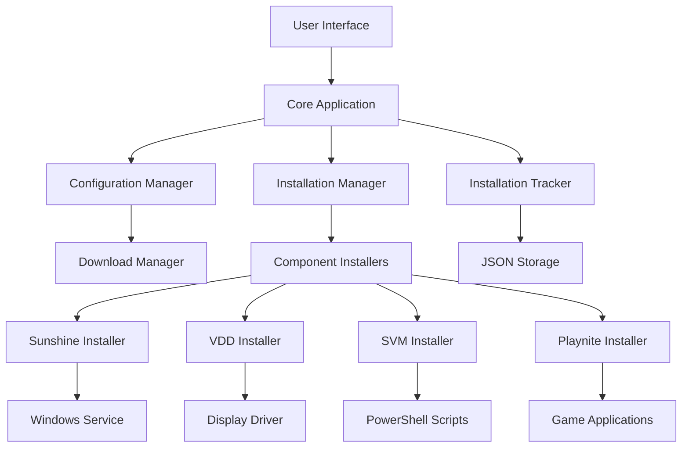
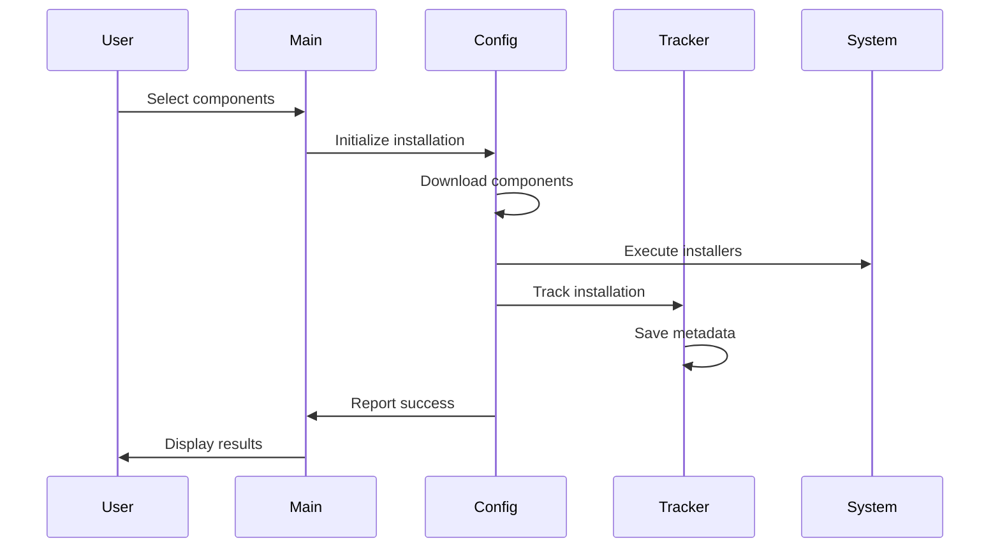
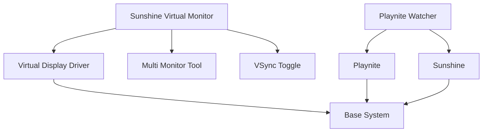

# Architecture Overview

Technical overview of Sunshine-AIO's system architecture, components, and design patterns.

## 🏗️ System Architecture

### High-Level Design



### Core Components

#### 1. **Application Core** (`src/main.py`)
- **Entry point** for CLI interface
- **Menu system** navigation and user interaction
- **Component orchestration** and workflow management
- **Error handling** and user feedback

#### 2. **GUI Interface** (`src/gui/`)
- **Modern UI** using CustomTkinter
- **Real-time progress** tracking and logging
- **Component selection** with visual feedback
- **Cross-platform** compatibility layer

#### 3. **Configuration System** (`src/misc/Config.py`)
```python
class Config:
    def __init__(self):
        self._sr = SystemRequests()
        self._tracker = InstallationTracker()
        
    def _download_file(self, url, name_filter=""):
        # Secure download with verification
        
    def _extract_archive(self, archive_path, destination):
        # Archive extraction with safety checks
```

## 🔧 Component Architecture

### Installation Tracker System

**Purpose:** Track all installed components for complete uninstallation

```python
class InstallationTracker:
    def __init__(self, base_path: str):
        self.tracker_file = "installation_tracker.json"
        self.installations = self._load_installations()
        
    def track_installation(self, component: str, path: str, metadata: dict):
        """Record installation details for later removal"""
        
    def get_all_installation_paths(self, component: str) -> List[str]:
        """Retrieve all paths for a component"""
```

**Data Structure:**
```json
{
  "sunshine": {
    "install_path": "C:\\Program Files\\Sunshine",
    "install_date": "2025-08-05T16:22:11.723976",
    "version": "latest",
    "installer_type": "official_installer",
    "files_created": ["C:\\Program Files\\Sunshine"],
    "registry_entries": ["HKEY_LOCAL_MACHINE\\..."],
    "services_created": ["SunshineService"],
    "drivers_installed": []
  }
}
```

### Component Installers

#### Sunshine Installer
```python
def install_sunshine(self) -> bool:
    """
    1. Download official installer
    2. Execute with silent parameters
    3. Configure Windows service
    4. Set up firewall rules
    5. Track installation artifacts
    """
```

#### Virtual Display Driver (VDD)
```python
def install_vdd(self) -> bool:
    """
    1. Download VDD Control package
    2. Extract to tools directory
    3. Launch VDD Control UI
    4. Guide user through driver installation
    5. Verify virtual display creation
    """
```

#### Sunshine Virtual Monitor (SVM)
```python
def install_sunshine_virtual_monitor(self) -> bool:
    """
    1. Download SVM from GitHub
    2. Install Windows Display Manager module
    3. Configure Multi Monitor Tool
    4. Set up VSync Toggle utility
    5. Create PowerShell management scripts
    """
```

## 📁 Directory Structure

```
Sunshine-AIO/
├── src/                          # Source code
│   ├── main.py                   # CLI entry point
│   ├── gui_main.py              # GUI entry point
│   ├── gui/                     # GUI components
│   │   ├── main_window.py       # Main application window
│   │   ├── pages/              # Individual UI pages
│   │   └── adapters/           # Business logic adapters
│   ├── misc/                    # Core modules
│   │   ├── Config.py           # Download and configuration
│   │   ├── SystemRequests.py   # System operations
│   │   ├── InstallationTracker.py # Installation tracking
│   │   ├── Uninstaller.py      # Removal system
│   │   ├── MenuHandler.py      # CLI menu logic
│   │   └── Logger.py           # Logging system
│   └── tools/                   # Downloaded components
├── requirements.txt             # Python dependencies
├── install.ps1                 # PowerShell installer
└── README.md                   # Project documentation
```

## 🔄 Data Flow

### Installation Workflow



### Component Dependencies



## 🛡️ Security Architecture

### Download Security
```python
def _download_file(self, url: str, from_github: bool = False):
    """
    Security measures:
    1. URL validation and whitelist
    2. HTTPS enforcement
    3. Certificate verification
    4. File integrity checks
    5. Malware scanning integration
    """
```

### Execution Security
- **Administrator privilege validation**
- **Digital signature verification** for executables
- **Sandboxed execution** where possible
- **Registry backup** before modifications
- **Rollback capabilities** on failure

### Data Privacy
- **No telemetry collection**
- **Local configuration storage**
- **Secure credential handling**
- **User consent** for all operations

## 🔌 Plugin Architecture

### Extendable Design
```python
class ComponentInstaller:
    """Base class for component installers"""
    
    def download(self) -> bool:
        raise NotImplementedError
        
    def install(self) -> bool:
        raise NotImplementedError
        
    def configure(self) -> bool:
        raise NotImplementedError
        
    def verify(self) -> bool:
        raise NotImplementedError
```

### Adding New Components
1. **Inherit from ComponentInstaller**
2. **Implement required methods**
3. **Register in component registry**
4. **Add to GUI interface**
5. **Update documentation**

## 📊 Configuration Management

### Configuration Layers
```python
# Default configuration
DEFAULT_CONFIG = {
    "sunshine": {
        "port": 47989,
        "cert_path": "sunshine.cert",
        "key_path": "sunshine.key"
    }
}

# User configuration override
USER_CONFIG = "config/user_config.json"

# Runtime configuration
RUNTIME_CONFIG = "temp/runtime_config.json"
```

### Settings Persistence
- **JSON configuration files**
- **Windows Registry integration** (when needed)
- **Environment variable support**
- **Command-line parameter override**

## 🧪 Testing Architecture

### Unit Testing Structure
```
tests/
├── unit/                    # Unit tests
│   ├── test_config.py      # Configuration tests
│   ├── test_installer.py   # Installation tests
│   └── test_tracker.py     # Tracking tests
├── integration/            # Integration tests
│   ├── test_download.py    # Download functionality
│   └── test_services.py    # Service management
└── fixtures/               # Test data
    ├── mock_installers/    # Mock installer files
    └── test_configs/       # Test configurations
```

### Testing Strategy
- **Mocked external dependencies**
- **Isolated test environments**
- **Automated CI/CD integration**
- **Performance benchmarking**

## 🚀 Performance Considerations

### Download Optimization
```python
def _download_with_resume(self, url: str, path: str):
    """
    Performance features:
    1. Resume interrupted downloads
    2. Parallel chunk downloading
    3. Bandwidth throttling options
    4. Progress reporting
    """
```

### Memory Management
- **Lazy loading** of components
- **Stream processing** for large files
- **Garbage collection** optimization
- **Resource cleanup** on exit

### Caching Strategy
- **Downloaded file caching**
- **Configuration caching**
- **Metadata caching**
- **Cache invalidation** logic

## 🔮 Future Architecture Plans

### Planned Enhancements
1. **Microservice architecture** for better modularity
2. **Plugin system** for community components
3. **Web-based management** interface
4. **Cloud configuration sync**
5. **Automated updates** system

### Scalability Considerations
- **Multi-user support** for shared systems
- **Network deployment** capabilities
- **Configuration templates**
- **Bulk installation** tools

---

*For implementation details, see the [API Reference](API-Reference) and [Development Setup](Development-Setup) guides.*